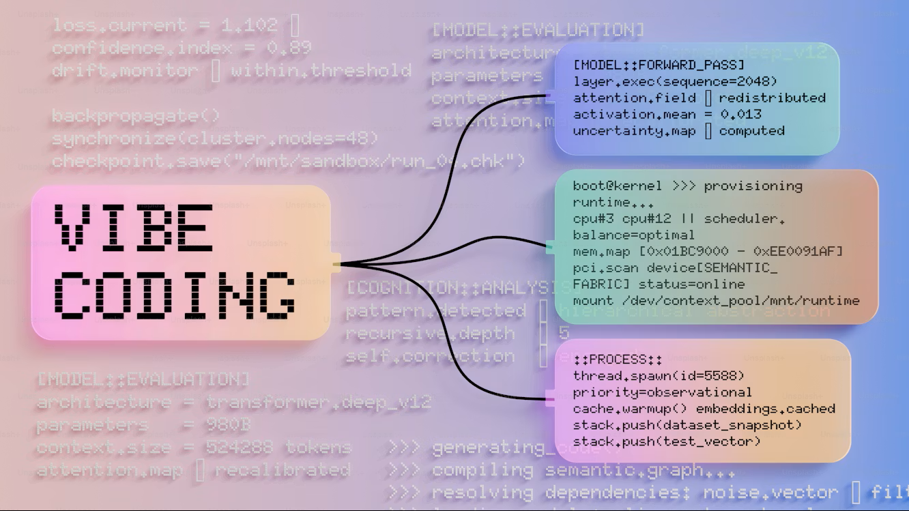

<h1 align="center">Hi,
  I'm Jaspreet Kaur</h1>

<p align="center">
  
</p>

<p align="center">
  
</p>

<p align="center">
  <a href="https://www.linkedin.com/in/jaspreet-kaur-4943363b7">
    
  </a>
  <a href="https://github.com/jaspreet204">
    
  </a>
</p>

---

## 👩‍💻 About Me

I'm a **Software Development student** interested in building web applications and learning how software works from development to testing.
I'm currently working with **C#, .NET, ASP.NET Core, REST APIs, SQL, Entity Framework Core, xUnit, and Moq** through my software development projects.
I enjoy learning by building projects, solving problems, and improving my coding skills one step at a time.

🎯 **Goal:** Grow my skills and gain real-world experience as a software developer.

---

## 🚀 What I'm Working With

<p align="center">
  
</p>

<p align="center">
  
  
  
  
  
  
</p>

---

## 💻 Technical Interests

```text
C# / .NET
ASP.NET Core
REST APIs
SQL & Databases
Entity Framework Core
Unit Testing
Moq
Web Development
Git & GitHub
```

---

## 🌱 Currently Learning

<p align="center">
  
  
  
  
  
</p>

---
## 📊 GitHub Stats

<p align="center">
  
  
</p>

<p align="center">
  
</p>

---

## 🤝 Let's Connect

<p align="center">
  <a href="https://www.linkedin.com/in/jaspreet-kaur-4943363b7">
    
  </a>
</p>

<p align="center">
  <i>Thanks for visiting my profile! 🚀</i>
</p>
